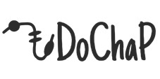

July 30th, 2020
#DoChaP 
The Domain Change Presenter (DoChaP) is a project designed for advancing the study of the effect of alternative splicing on protein domains.
This project includes data collection and build of an independent SQLite database (DoChaP-db, can be downloaded from: https://dochap.bgu.ac.il/downloads/), a web-server for the visualization of the connection between alternative splicing and protein domains (DoChaP: https://dochap.bgu.ac.il/) and a Transcript Functional Similarity Measure (TFSM).
### Directory list:
##### 1- DoChaP-db: 
Include all the code for download, parsing and building the independent DoChaP database.
##### 2- DoChaP-web:
Include all the code for DoChaP- webserver- https://dochap.bgu.ac.il/
##### 3- TFSM:
Transcript Functional Similarity Measure (TFSM) represents the similarity between different transcripts of the same gene, and different transcripts of homologous genes, by incorporating information of sequence similarity, exon structure, and functional domains annotated to the encoded protein. This sub-project is still not yet available. 
 
